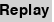

# Rabbit hunt

Short game description
---------------------------

Here's the story:
A fox is hunting a rabbit in a field. The field contains a number of bushes which obstruct both the
fox's view and the rabbit's view, so each may or may not be able to see the other. The fox tries to
catch the rabbit; the rabbit tries to get away from the fox. If the fox can catch the rabbit, he eats it
(and wins). If the rabbit can keep away from the fox for 100 turns, the rabbit wins.

You are the rabbit.

Something like this:

  

  The orange triangle represents the fox, the small brown dot is the rabbit, and the green squares are bushes.

Our task was to make the rabbit as smart as possible, that is, to come up with an algorithm which helps the rabbit win the game as often as possible.
   
By clicking on the appropriate button, it is possible to:

*   Pokrenuti animaciju.

*  Pause animation.

*  Follow the movement of the fox and the rabbit step by step. With one click, both the rabbit and the fox take one step at a time.

*  Start the game from the beginning, ie place the bushes, fox and rabbit on the field again.

* * Go back one step. Going back, the game doesn't have to be the same.

  It is also possible to adjust the speed at which the fox and the rabbit move. Of course, the speed of the simulation does not affect the outcome.

When the game ends by pressing (r) the game restarts and (q) stops running.

Longer description of the game
-----------------

Let's explain more precisely how the game works. The fox and the rabbit move on a grid measure 25x25. There are 60 bushes on that table, which are obstacles. The fox and the rabbit take turns, with the fox taking the first step. Step means move one field up, down, left or right. So there are no diagonal steps. At the beginning of the game, the positions of the fox and the rabbit are chosen at random, but so that they are always at a distance of 7 and so that they can be seen. Let's define now what it means that fox and a rabbit can see each other. Mathematically speaking a fox and a rabbit can see each other if the line that connects the centers of the fields where they are located does not cut the inside of any field where the bush is located. The reason they are always seen at the beginning of the game is because we think the simulation is more interesting, and the distance was chosen with the only necessary criterion to be odd, considering that the fox plays first.

During testing, we noticed an interesting thing. For relatively small changes in the density of bushes, the probability that the rabbit wins changes slightly, but in extreme cases there are large changes unfavorable for the rabbit. This is shown in the following histogram:

  

  x axis represents the number of bushes

Depending on the initial distance between the fox and the rabbit, the probability that the rabbit wins also changes slightly. But what is changing is the number of parties in which the rabbit dies at the very beginning. With a small distance between a fox and a rabbit, it happens that, no matter how smart our rabbit was, it simply comes to an inevitable end. The following diagram demonstrates just that:

  < img width = "261" height = "253" src = images/statistika2.png>

Let's discuss now how does the fox move. If the fox sees a rabbit, the fox looks for the shortest path to the field where the rabbit is and in most situations fox chooses to take a step that suits that path. If she still doesn't see him, she looks for a path to the field where the rabbit was last seen. This path was searched using the A * algorithm using the Euclidean distance heuristic. We also wanted to make a smart fox so with a probability of 1% the fox makes a random step. It turns out that this unpredictability can confuse rabbit in certain situations.

Before describing the algorithm by which the rabbit moves, let us note that this algorithm significantly increases its chances of winning. Namely, when starting the program 1000 times at random movement, the rabbit never managed to win, and the median number of steps with which the game ends is 8.

Using algorithm that follows the rabbit's chances of winning are about 42%, while the median number of steps with which the game ends is 154.

The rabbit chooses the next field to move when its his turn to play. There are fields that are out of the question - fields where there are bushes, fields that are at a distance of 1 from the fox or that are a dead-end. Of the remaining fields, the rabbit chooses one, let's call it a potential field, based on the following factors:
1) the distance of the potential field from the fox
2) distance of the potential field from the center of the table
3) the number of "good" bushes that are closer to the potential field than the fox
4) the number of bushes with which the potential field borders
5) whether the potential field is visible from the field where the fox is currently

We are still obliged to explain what a good bush is. A bush is good if it can be bypassed, that is, if there is a path around that bush. Formally and mathematically speaking, a bush is not good if it borders with the edge of a table, or if it has a common point with some other bush that is not good. Therefore, based on the previously mentioned factors, the price of the field is calculated, and the field with the lowest price is selected.

The question is: how important is each of these factors in assessing rabbit movement?

After numerous tests, the conclusion is as follows: the rabbit achieves the best results when, when deciding on the next position, it favors avoiding movement along the very edges of the board in relation to other factors.

Languages and technologies used
---------------------------------------
The program is written in Python3, and Visual Studio Code and PyCharm were used.

The pygame module was used for visualization. Heapq, collections and numpy modules were also used.

Launching
----------
The executable file was created for Windows operating system.

Download RabbitHunt.exe from the releases section. Running the RabbitHunt.exe file in the selected folder will create a new folder named RabbiitHunt. A simulation is available within this folder.

Authors
-------
* Katarina Branković
    katarinab70@gmail.com

* Jana Vučković
    jana.vuck@gmail.com

* Marko Popović
    popsgljb@gmail.com

